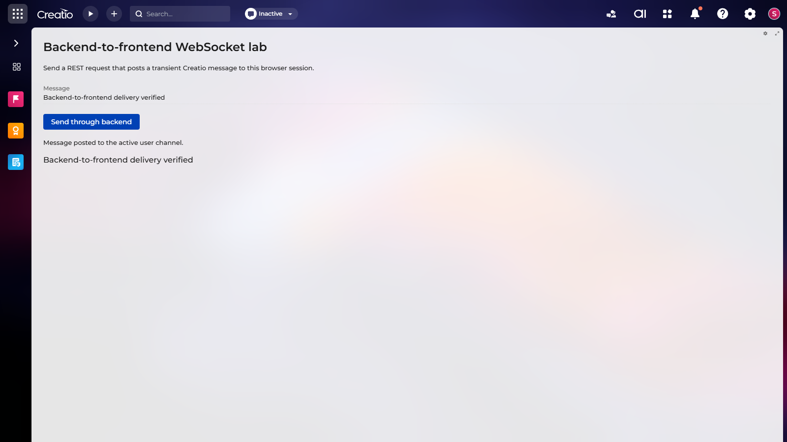

# Creatio backend-to-frontend WebSocket reference

This repository is a small, executable Creatio lab for sending a transient message from C# backend code
to a Freedom UI page. It demonstrates the platform message channel directly, without introducing a custom
WebSocket server or protocol.



## What the lab teaches

- resolve Creatio's running `MsgChannelManager` and find the authenticated user's active channel;
- create a `SimpleMessage` whose `Header.Sender` is the frontend routing key;
- serialize the body as JSON before posting it;
- subscribe with `sdk.MessageChannelService` from `@creatio-devkit/common`;
- pair the subscription with Freedom UI resume and pause lifecycle handlers;
- handle an offline browser as an expected non-delivery result;
- unit-test the sender, body, user targeting, validation, and failure paths.

The message is transient. It is delivered only while the target user has an active browser channel. It is
not a durable queue and should not replace persisted state or a background-job result store.

## End-to-end flow

```text
Freedom UI button
  -> POST /rest/WebSocketReferenceService/SendToCurrentUser
  -> current UserConnection.CurrentUser.Id
  -> MsgChannelManager.Instance.FindItemByUId(userId)
  -> SimpleMessage { Header.Sender = "WebsocketLab.Message", Body = JSON }
  -> sdk.MessageChannelService.subscribe("WebsocketLab.Message", callback)
  -> page attributes update with the received payload
```

The service deliberately targets only the authenticated current user. Accepting an arbitrary user ID from
the browser would broaden the authorization boundary and is unnecessary for this reference case.

## Repository map

| Path | Purpose |
|---|---|
| `packages/WebsocketLab/Files/src/cs/Messaging` | Publisher, JSON payload, and explicit delivery result. |
| `packages/WebsocketLab/Files/src/cs/EntryPoints/WebServices` | Thin configuration web service for the current user. |
| `packages/WebsocketLab/Schemas/UsrWebsocketReference_Page` | Freedom UI page using the modern message-channel API. |
| `tests/WebsocketLab` | NUnit, FluentAssertions, and NSubstitute unit tests. |
| `docs/lab-record.md` | Evidence, failed experiments, boundaries, and repeatable acceptance steps. |

## Backend pattern

The essential backend operation is intentionally small:

```csharp
if (!MsgChannelManager.IsRunning) {
	return WebSocketPublishResult.NotDelivered("The Creatio message channel is not running.");
}

IMsgChannel channel = MsgChannelManager.Instance.FindItemByUId(userId);
if (channel == null) {
	return WebSocketPublishResult.NotDelivered("The current user has no active browser channel.");
}

IMsg message = new SimpleMessage {
	Id = Guid.NewGuid(),
	Body = JsonConvert.SerializeObject(payload)
};
message.Header.Sender = "WebsocketLab.Message";
try {
	channel.PostMessage(message);
} catch (Exception) {
	return WebSocketPublishResult.NotDelivered(
		"The active user channel closed before the message could be posted.");
}
```

Check both the manager and channel. `FindItemByUId` returns `null` when the user has no connected browser.
`Header.Sender` and the frontend subscription name must match exactly. The body must be valid JSON because
the modern frontend service parses string bodies before invoking subscribers.

## Frontend pattern

The page imports the public SDK and owns one subscription:

```javascript
define("UsrWebsocketReference_Page", ["@creatio-devkit/common"], function(sdk) {
	const senderName = "WebsocketLab.Message";
	return {
		handlers: [
			{
				request: "crt.HandleViewModelResumeRequest",
				handler: async (request, next) => {
					await next?.handle(request);
					if (request.$context.UsrWebSocketSubscription ||
						request.$context.UsrWebSocketSubscriptionPending) {
						return;
					}
					const channel = new sdk.MessageChannelService();
					const pending = channel.subscribe(
						senderName,
						async (event) => request.$context.set("UsrWebSocketReceivedMessage", event.body.message)
					);
					request.$context.UsrWebSocketSubscriptionPending = pending;
					const subscription = await pending;
					if (request.$context.UsrWebSocketSubscriptionPending === pending) {
						request.$context.UsrWebSocketSubscriptionPending = null;
						request.$context.UsrWebSocketSubscription = subscription;
					}
				}
			},
			{
				request: "crt.HandleViewModelPauseRequest",
				handler: async (request, next) => {
					request.$context.UsrWebSocketSubscription?.unsubscribe();
					request.$context.UsrWebSocketSubscription = null;
					const pending = request.$context.UsrWebSocketSubscriptionPending;
					request.$context.UsrWebSocketSubscriptionPending = null;
					(await pending)?.unsubscribe();
					return next?.handle(request);
				}
			}
		]
	};
});
```

Use either resume/pause or init/destroy as a paired lifecycle. Resume/pause is preferable for pages that
can be suspended while remaining alive. Always unsubscribe, or repeated navigation can leave duplicate
callbacks behind. Do not use the legacy `Terrasoft.ServerChannel` API for new Freedom UI pages.

## Build and unit-test

Prerequisites:

- a Creatio environment registered in clio;
- .NET 8 SDK;
- package build references restored into the ignored `.application` directory.

```powershell
clio restorew -e <environment-name>
dotnet build MainSolution.slnx -c dev-n8
dotnet test tests/WebsocketLab/WebsocketLab.Tests.csproj -c dev-n8 --no-build
```

The focused suite verifies successful publication, exact routing sender, JSON payload correlation, missing
user channel, stopped manager, disconnect races, authenticated-user targeting, REST validation boundaries,
failure-as-value mapping, and frontend lifecycle contract parity.

## Load and run the lab

Follow the live clio guidance for the target environment's deployment mode. In file-system mode, where the
package folder is linked directly into Creatio, the tested flow is:

```powershell
dotnet build MainSolution.slnx -c dev-n8
clio restart-web-app -e <environment-name> --wait-ready
```

Open the page on a .NET 8 Creatio instance:

```text
<creatio-base-url>/Shell/#Section/UsrWebsocketReference_Page
```

Enter a message and choose **Send through backend**. Success requires three independent observations:

1. the REST request returns HTTP 200 with `success: true` and non-empty `correlationId` and `eventId`;
2. the page status says the message was posted to the active user channel;
3. the received-message label displays the text carried by the WebSocket event.

## Security and operational boundaries

- Treat the payload as user-visible data and avoid secrets or unrestricted business records.
- Prefer HTTPS outside an isolated local development environment.
- Use `PostToAll` only for an explicitly authorized broadcast; it sends to every active user channel.
- Do not interpret a successful `PostMessage` call as durable processing or offline delivery.
- Keep payloads small. Persist large or important results and send only an identifier or refresh signal.
- Never commit Creatio credentials, session cookies, `.application`, build output, or `TASK.md`.

## Relationship to Clio Knowledge

The canonical agent workflow is published by
[`clio-knowledge`](https://github.com/Advance-Technologies-Foundation/clio-knowledge). This repository is
the executable reference behind that guide. The guide owns reusable decisions and safety rules; this lab
preserves the complete implementation and observed evidence.

## License

The example source is licensed under the [MIT License](LICENSE). Creatio platform binaries and packages
remain subject to their own license and are not distributed by this repository.
